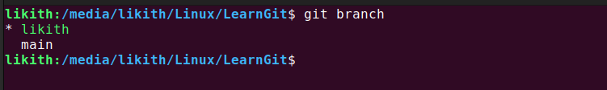

# LearnGit🍀

Welcome to this ongoing repository Learngit.\
Aim & Applications of this Repo- \
1.) Guide & Reference for learners.\
2.) Weekly updates.\
3.) Learn along with diagrams for basic understanding of git & github.\
4.) Learn how to write README file.

-------------------------

### configuration part
git config --list\
git config --global user.name "name"\
git config --global user.email "mail"\
git config --list\

-------------------------

### SSH key generation local device to remote github
ssh-keygen -t ed25519 -C "mail"

#Clone a Repo\
git clone [url]

-------------------

### working with files
git add home.html #add file to staged area\
git restore --staged home.html #remove file from staged area\
git status

git add -A #add all files from repo\
git commit -m "message" #Commit with message\
`git commit --amend -m "Updated commit message"` to update the commit message\
Git diff - changes made\
Git log –oneline\
Git show "commit id"

--------------------

### BRANCHES
git branch "branch name" #create branch\
git branch #check branch\
git checkout "branch name" #switch branch\
git checkout -b "branch name" #directly create and switch branch

`git switch -c <branch-name>` #directly create and switch branch alternate command

`git branch -m <branch-name>` to **rename** the current branch

delete:\
git branch -d "branch name"

### Search Emojies for README file

Select the emojies you need\
[https://emojipedia.org/](https://emojipedia.org/)

